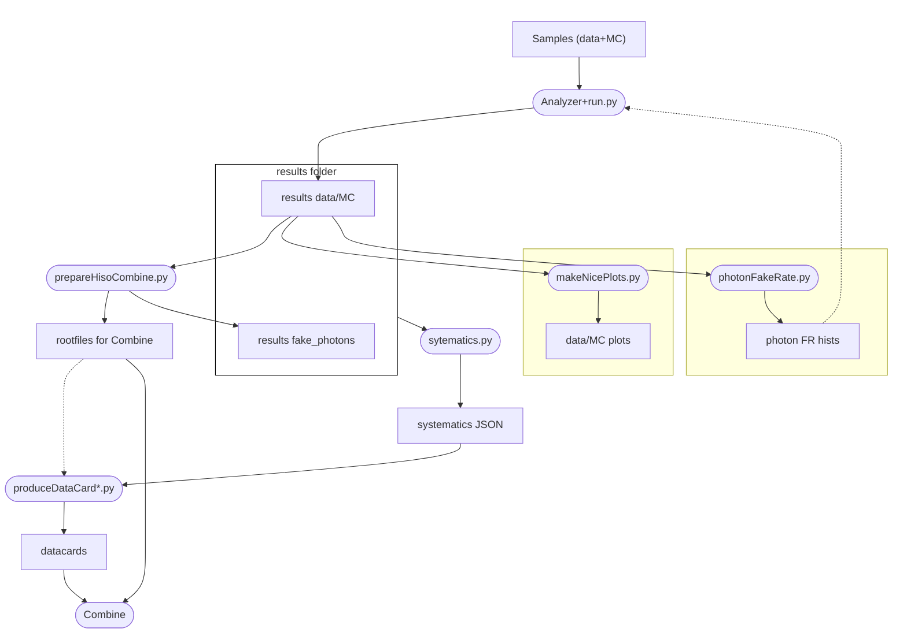

## Analysis workflow
Generally speaking, the goal of an Analyzer is to produce histograms from the ntuples (samples).
The rootfiles with the histograms are stored in a folder named "results"; a custom name may be given via command line options, see `run.py -h` for a list of supported arguments.
These histograms are the starting point of the rest of the analysis.
Several scripts are used to produce plots of many kinds of plots (data/MC comparison, efficiencies, ...) 
or files, both textual and binary, that are meant to be used as input to other scripts, e.g. for Combine.
Usually scripts that use the Python language are under `python`
even if they are not meant to be imported by other scripts, 
while ROOT macros are under `macros`
and `scripts` contains mostly shell scripts.
Although each analysis has unique requirements, we strive to avoid reinventing the wheel, 
and instead prefer upgrading/modifying/fixing existing code.

The following diagram illustrates the interconnection between scripts via their respective outputs.

Legend:
- nodes with rectangular edges indicate files that are used as input/output by the scripts;
- nodes with round edges ("stadium-shaped") indicate scripts/programs;
- incoming arrows indicate file used by a script;
  - full arrows are the main inputs;
  - dotted arrows are additional inputs;
- outgoing arrows indicate files that are produced by the script.

This is is the workflow employed by the VVGamma analysis, and contains some analysis-specific details.
For example, both `systematics.py` and `prepareHistoCombine.py` identify the set of histograms with the systematic variations
assimung the following naming scheme in the output of the analyzer:
- the central value is in `SYS_[variable]_central`
- the up/down variations are in `SYS_[variable]_[systematic]_Up/Down`

### Common options
Most scripts permit to specify an input folder (usually the `-i` option) and output (usually `-o`).
In most cases, if the output name is not specified, the input name is used by default;
for example, the images produced by `makeNicePlots.py -i results_SMPmeeting` will be under `Plots/SMPmeeting`.

Most scripts will also have an option for the analyzer name (usually `-A`), which may be used 
to find the results (which are in `results*/[year]/[analyzer]_[region]/[sample].root`)
or to name the output, for example.
The options for the year (`-y`) and region(s) (`-r`) are used for similar purposes.

Samples to be used for the analysis
-----------------------------------------------
-----------------------------------------------

All samples processed in the analysis work-flow are listed here VVXAnalysis/Producers/python/samples_8TeV.csv, however, not all samples are mutually exclusive.

We can devide the them into two possible sets that contains (almost) totally mutually exclusive samples.

The MadGraph set
-----------------------------------------------

- qq,qg,gg -> 4l +0,1,2 j (MadGraph). LO for the zero jet bin, NLO for the others
   - ZZJetsTo4L 
- gg -> 4l (MCFM). LO. Nickname: gg_4l.
   - ggTo4e_SMHContinInterf-MCFM67_H125.6
   - ggTo4mu_SMHContinInterf-MCFM67_H125.6
   - ggTo2e2mu_SMHContinInterf-MCFM67_H125.6
- qq -> 4l + 2 j (Phantom samples). LO. Nickname: qq_4l2j.
   - ZZTo4eJJ_SMHContinInterf_H125.6
   - ZZTo2e2muJJ_SMHContinInterf_H125.6
   - ZZTo4muJJ_SMHContinInterf_H125.6
- Higgs samples
   - powheg15jhuGenV3H126
   - VBFH126
   - ttH126
   - ZH
   - WH
- Dibosons
   - WZ
   - WWJets
   - WGToLNuG
- Tribosons
   - WZZJets (or WZZ_aMCatNLO)
   - WWWJets
   - WWZJets
   - ZZZJets
   - WWGJets
- ttbar
   - TTTo2L2Nu2B
   - TTWJets
   - TTZJets
   - TTWWJets
   - TTGJets

The Powheg set
-----------------------------------------------

- qq,qg -> 4l + 1 j (Powheg). NLO. Nickname: qq_ZZ.
   - ZZTo4mu
   - ZZTo4e
   - ZZTo2mu2tau
   - ZZTo2e2tau
   - ZZTo2e2mu
   - ZZTo4tau
- qq -> 4l + 2 j (Phantom samples). LO. Nickname: qq_4l2j.
   - ZZTo4eJJ_SMHContinInterf_H125.6
   - ZZTo2e2muJJ_SMHContinInterf_H125.6
   - ZZTo4muJJ_SMHContinInterf_H125.6
- gg -> 4l (MCFM). LO. Nickname: gg_4l.
   - ggTo4e_SMHContinInterf-MCFM67_H125.6
   - ggTo4mu_SMHContinInterf-MCFM67_H125.6
   - ggTo2e2mu_SMHContinInterf-MCFM67_H125.6
- Higgs samples
   - ttH126
- Dibosons
   - WZ
   - WWJets
   - WGToLNuG
- Tribosons
   - WZZJets (or WZZ_aMCatNLO)
   - WWWJets
   - WWZJets
   - ZZZJets
   - WWGJets
- ttbar
   - TTTo2L2Nu2B
   - TTWJets
   - TTZJets
   - TTWWJets
   - TTGJets

Additional remarks
-----------------------------------------------

- gg_4l are at LO, but Passarino calculated the K factor to go to NNLO. It is an inclusive value, that might depend on jets multiplicity.
The correction could be sizable, as for the inclusive KF it was obtained something of the order of 2 (for a population that account for the 10% of the total).
- An EWK correction for all qq process needs to be applied. Right now, it exist as a KF and the depedence as a function of the number of jets is unknown. Also this correction can be sizable.
- Signal lies in qq_ZZ, qq_4l2j, gg_4l, Higgs samples, WZZJets, ZZZJets.
- Irreducible background in: WWZJets, TTZJets, TTWWJets.
